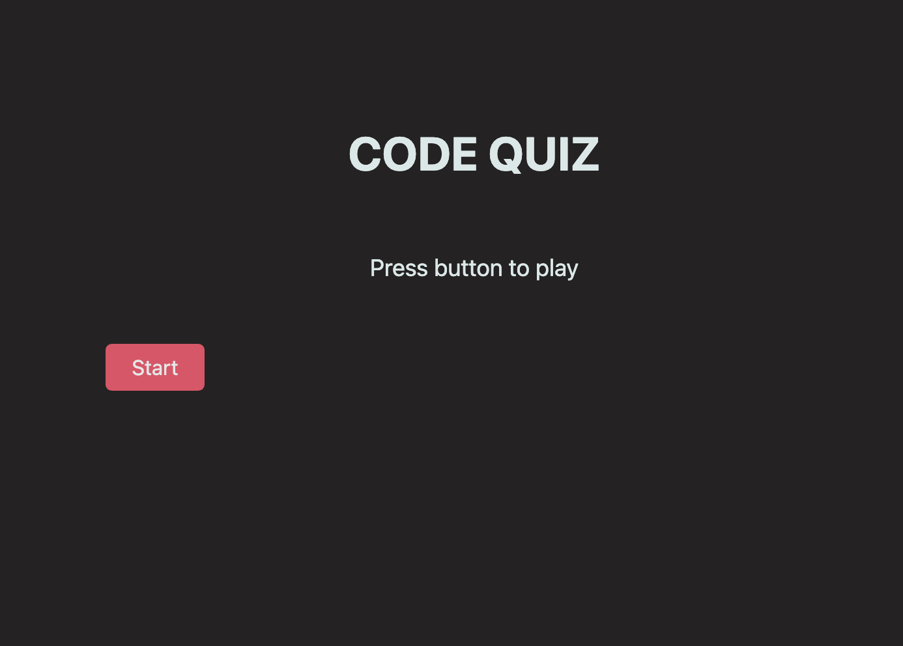

 ## Code Quiz Homework
I didn't get to finish unfortunately but I did spend more time on my readme.

## Known Issues
*  `Answer buttons` will only show the 4th value of whichever question it is on. Will not advance the question. Will not add or subtract time from the timer.
* ~~`Start button` has to be pressed twice to work. I think it's because of the event listener.~~
*  `Timer` is not near the other elements.
*  `Scoring` Did not start.
*  `Timer` doesn't show at the highest value. I faked it and put a 7 in the html div, then the timer replaces it when it get to 6.

## Links
[Github Repository](https://github.com/MatteoThomas/04-homework-code-quiz)

[Code Quiz Homework](https://matteothomas.github.io/04-homework-code-quiz/)

## Preview
